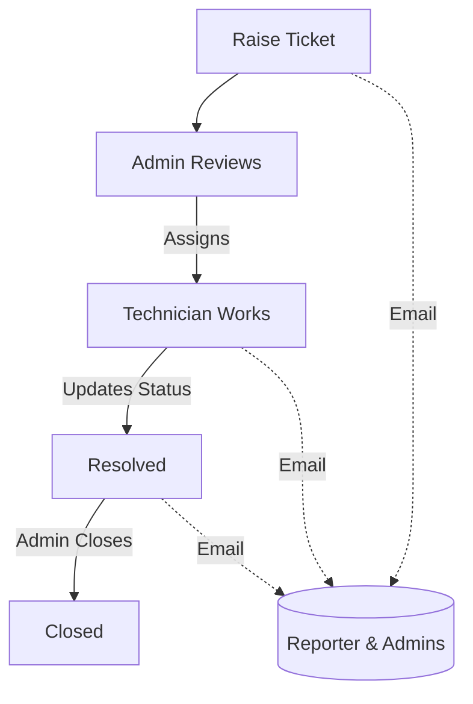

# Ticket System

Simple tool to report tech issues on campus and track them to closure.

### Problem statement (PS)
Campus teams need a simple way to raise, track, and close IT issues with clear ownership and timely updates. The system should enforce complete requests, support assignment and status changes, and notify stakeholders reliably.

### Why
- To make it easy for anyone to raise a request.
- To keep assignees and admins in sync without chasing chats.
- To have a single place to see status and history.

### What
- Create tickets with required details: `Name`, `Category`, `Sub-Category`, `Description`, `Room/Lab`, `Department`.
- Track lifecycle: assign, change priority, resolve, close. Everything is logged.
- Get emails on create and on updates (reporter + admins).

### How
- Go to `/tickets/new`, fill the form, submit.
- Admin assigns or updates status/priority.
- System logs activities and sends emails.

### Recommended design pattern
Adopt a layered (clean) architecture that fits the Next.js App Router while keeping the codebase small and maintainable.

- **Presentation (UI/API)** — `src/app/**`
  - Pages and API route handlers only coordinate requests/responses.
  - No business rules here; defer to services.
- **Application (Services / Use-cases)** — `src/services/`
  - Implements use-cases: create ticket, assign, update status/priority, send notifications.
  - Depends on domain models and infrastructure via small functions (no circular deps).
- **Domain (Models / Types)** — `src/models/`
  - Mongoose schemas for `Ticket`, `User`, `Activity`.
  - Validation and indexes close to data.
- **Infrastructure (Adapters)** — `src/lib/`
  - DB connection (`db.js`), mail (`mail.js`), auth (`jwt.js`), events (`events.js`).

Suggested layout:
```text
src/
  app/                 # Presentation (UI + API routes)
  models/              # Domain models (Ticket, User, Activity)
  services/            # Application layer (TicketService, NotificationService)
  lib/                 # Infrastructure (db, mail, auth, events)
  components/          # UI components
```

Why this fits:
- Keeps UI/API thin; logic is testable in services.
- Clear boundaries make SMTP/DB changes low-risk.
- Scales from a single repo without over-engineering.

Alternatives considered:
- **Fat API routes only**: faster to start, but mixes concerns, harder to test.
- **Microservices**: unnecessary complexity for campus-scale traffic.

Coding guidelines:
- Services return clear results/errors; API layers handle HTTP codes.
- No service importing from `app/`. One-directional dependency flow.
- Use DTOs/shape objects between layers if APIs grow.

---

## Key features
- **Required-by-default form** in `src/app/tickets/new/page.js` so requests are complete from the start.
- **Category → Sub-Category** dependent dropdowns for cleaner data.
- **Activity log** in `src/models/Activity.js` for every important change.
- **Email alerts** (create/update) wired in API:
  - `src/app/api/tickets/[id]/route.js`
- **Admin screen** to view and act on tickets.

## Roles & permissions
- **Reporter**: create and view their tickets.
- **Technician**: update status of tickets assigned to them (cannot close).
- **Admin**: assign, change priority, resolve, close, view all.

## How it flows


---

## How to run
```bash
# From ticket_system/
npm install
npm run dev
# http://localhost:3000
```

- Create ticket: `http://localhost:3000/tickets/new`
- Admin area: `http://localhost:3000/admin`

## Configure email (SMTP)
Create `ticket_system/.env.local`:

```env
APP_BASE_URL=http://localhost:3000

# SMTP for emails
SMTP_HOST=smtp.yourprovider.com
SMTP_PORT=587            # use 465 if SSL
SMTP_USER=your_user
SMTP_PASS=your_pass
SMTP_FROM="Ticket System <no-reply@yourdomain.com>"
```

Emails are sent using `src/lib/mail.js`. In dev, if SMTP vars are missing, emails are skipped with a console warning.

---

## Troubleshooting
- **No emails arrive**
  - Check `.env.local` values; try port `465` with SSL if your provider needs it.
  - Restart dev server after changing env: stop, then `npm run dev`.
  - See server logs for lines starting with `[mail]`.
- **Build error: Cannot resolve 'nodemailer'**
  - Run `npm install` in `ticket_system/` and restart dev.
- **Form won’t submit**
  - All fields are mandatory. Pick a Category before Sub-Category.

## FAQ
- **Where are models?** `src/models/` (`Ticket.js`, `User.js`, `Activity.js`).
- **Where are APIs?** `src/app/api/` (create at `tickets/route.js`, updates at `tickets/[id]/route.js`).
- **Who gets emails?** Reporter and all admins.
- **What builds the title?** We auto-generate from the first 100 chars of the description on create.

---

## 📨 Email Notification System

### Features
✅ **Comprehensive HTML Email Templates** - Beautiful, responsive emails with inline CSS
✅ **Smart Notifications** - Context-aware notifications for all ticket activities
✅ **User Preferences** - Users can control which notifications they receive
✅ **Notification Tracking** - All emails logged in database for audit and debugging
✅ **Assignment Notifications** - Assignees get special notifications when tickets assigned to them

### Notification Types
1. **Ticket Created** - Sent to reporter + admins
2. **Ticket Updated** - Sent to reporter + assignee + admins (status/priority changes)
3. **Ticket Assigned** - Special notification to the assignee
4. **Comment Added** - Sent to reporter + assignee + admins (excludes commenter)
5. **Profile Updated** - Sent to user when admin updates their profile

### Architecture
- **Email Service**: `src/lib/mail.js` (Nodemailer with Gmail/SMTP)
- **Templates**: `src/lib/emailTemplates.js` (HTML templates for each notification type)
- **Notification Service**: `src/services/notificationService.js` (Central notification logic)
- **Tracking Model**: `src/models/Notification.js` (Logs all sent emails)
- **User Preferences**: `src/models/User.js` → `notificationPreferences` field

### User Management
- **Preferences Page**: `/profile/notifications` - Users can toggle notification types
- **Admin Dashboard**: `/admin/notifications` - View notification history and stats
- **API Endpoints**: 
  - `GET/PATCH /api/users/preferences` - Manage preferences
  - `GET /api/admin/notifications` - View notification logs (admin only)

### How It Works
1. User action triggers event (create ticket, add comment, etc.)
2. Notification service checks user preferences
3. HTML email generated from template
4. Email sent via SMTP (if enabled)
5. Result logged to Notification collection
6. Users notified except those who triggered the action

### Configuration
All SMTP settings in `.env.local`:
```env
SMTP_HOST=smtp.gmail.com
SMTP_PORT=587
SMTP_USER=your-email@gmail.com
SMTP_PASS=your-app-password
SMTP_FROM="Campus Ticket System <your-email@gmail.com>"
APP_BASE_URL=http://localhost:3000
```

**Test your setup**: Run `node test-email.js` from `ticket_system/` directory

---

## 🗂️ Categories Cheat Sheet
- `Application`: Mail, Antivirus, PDF Editor, MS Office, HRMS Portal, Teams, Spectrum, Tally ERP, Designing Application, Website Access, Digital Signature, Webex, Email & Support
- `Hardware`: Data Card, Printer, Switch, Desktop, Connector Crimp, LCD/Projector, Interactive Board, Laptop, Tablet, Barcode Scanner, Server, Router, Scanner Problem, Printer Toner, Mouse/Keyboard, Access Point, CCTV, HDD, CMOS, Motherboard, Hardware Maintenance
- `Network`: Internet, IP Configuration, Wireless Network, Switch Config, Firewall User, Cable Laying, Certificate/FW, Network Troubleshoot, Site Visit, Link Issue, Bandwidth
- `Operating System`: OS Installation, OS Repair, Linux, Mac, Windows Error, Windows Update

---

## 🧰 Troubleshooting (Drama Detox)
- **Module not found: 'nodemailer'** → run `npm install` in `ticket_system/`, then restart `npm run dev`.
- **No emails** → verify `.env.local` SMTP vars; check server logs for `[mail]` warnings.
- **Form won’t submit** → all fields are mandatory; choose a Category before Sub-Category.

---

## 🛠️ Project Layout
- API Routes: `src/app/api/`
- Models: `src/models/`
- UI Components: `src/components/ui/`
- Create Ticket: `src/app/tickets/new/page.js`

---

## 🎯 Mission
Keep campus support flowing: fast intake, clear ownership, traceable progress, and loud notifications. Less chaos, more closure. 💪

